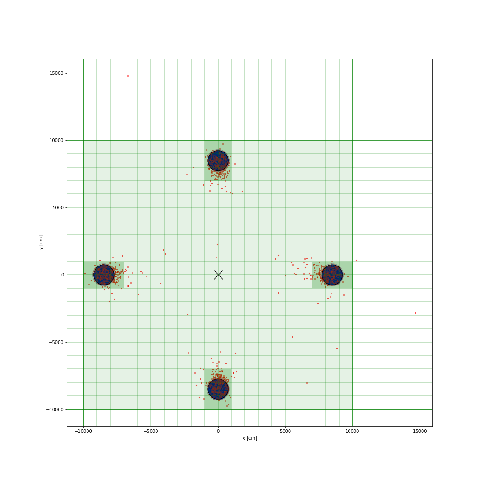

# Inspection of IACT output for air fluorescence photon bunches simulated with CORSIKA

  - IACT/ATMO package version 1.50.

Here I show an example of photon bunches (red for fluorescence and blue for Cherenov) projected on the ground. IACT option of CORSIKA has been used to store those bunches.

### Content:
  - *data*: output data from several test runs
  - *IACT_output_inspection.ipynb* jupyter notebook with some examples.
